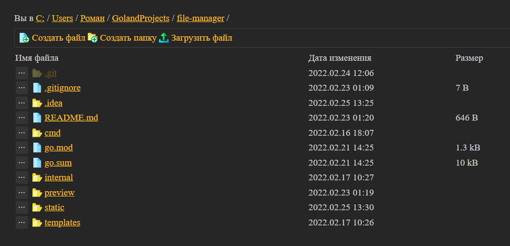
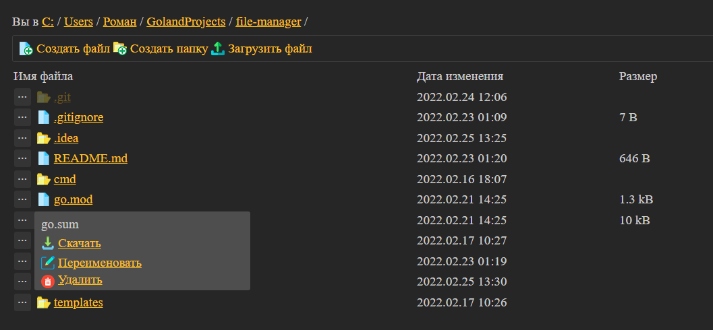
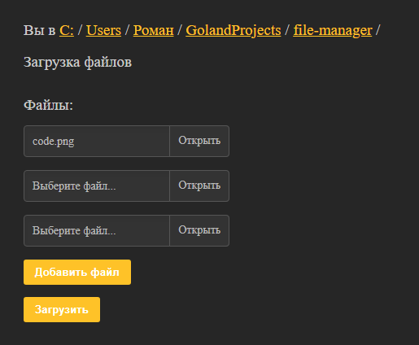

## Файловый менеджер на Golang

Функции:
- Просмотр файлов и папок
- Создание папок и текстовых файлов
- Просмотр текстовых файлов и картинок
- Скачивание файлов
- Переименование файлов и картинок
- Удаление файлов и картинок

Просмотр папки:  
  
Контекстное меню файла:  
  
Просмотр изображения:  
  
Загрузка файлов:  
  
